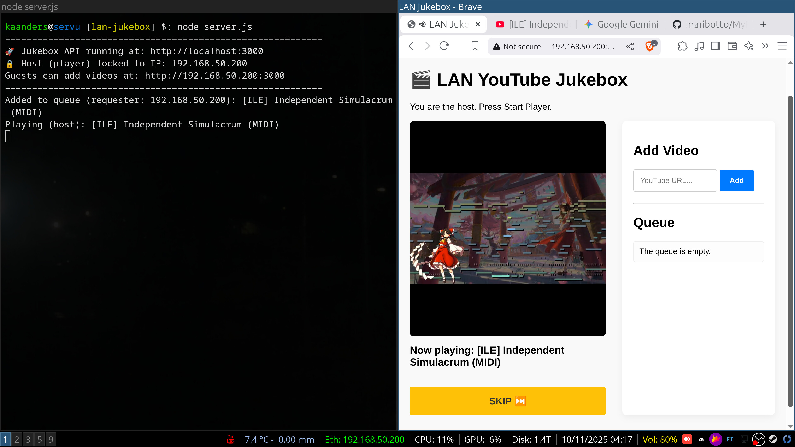

# 🎬 LAN YouTube Jukebox

A web application that allows LAN party guests to add YouTube videos to a shared playback queue. The host machine (identified by IP address) automatically plays the videos in sequence.

- Utilizes [node.js](https://nodejs.org) (`npm` and `node` commands)
- Install easily using [Docker](https://www.docker.com/)
- Windows `.exe` provided in the **Releases** section



[](https://github.com/maribotto/lan-jukebox/actions/workflows/test.yml)
[](https://hub.docker.com/r/maribotto/lan-jukebox)

## ✨ Features

- 🎵 **Automatic playback** - Host machine plays videos in order
- 🚫 **Embed validation** - Blocks non-embeddable videos at submission time
- ⏭️ **Auto-skip** - Automatically skips videos that fail to start within 10 seconds
- ❌ **Clear error messages** - Displays YouTube error codes with explanations
- 🔒 **IP-based authentication** - Only the host can control playback
- 📱 **Responsive design** - Works on mobile devices

## 🧩 Browser Extensions

Add YouTube videos to your LAN Jukebox directly from the YouTube website:

- **Chrome/Edge Extension**: [lan-jukebox-extension](https://github.com/maribotto/lan-jukebox-extension)
- **Firefox Extension**: [lan-jukebox-extension-firefox](https://github.com/maribotto/lan-jukebox-extension-firefox)

## 🚀 Quick Start

### How to figure out your LAN IP address

  **Windows**:
  ```
  ipconfig
  ```

  **Linux**:
  ```
  ip addr show
  ```

  **Mac**:
  ```
  ifconfig | grep "inet"
  ```

  **💡 Tip**: Instead of using IP addresses, you can use your computer's hostname! Most systems support `.local` mDNS names (e.g., `my-computer.local`). The server will display this address when it starts.

### Docker Hub (Easiest)

Pull and run the pre-built image directly from [Docker Hub](https://hub.docker.com/r/maribotto/lan-jukebox):

```
docker pull maribotto/lan-jukebox:latest
docker run -d -p 3000:3000 -v $(pwd)/config.json:/app/config.json:ro maribotto/lan-jukebox:latest
```

### Docker Compose (Recommended)

1. **Create config.json**
   ```
   cp config.example.json config.json
   ```
   Then edit `config.json` and replace the IP with your host machine's IP address.

2. **Start the container**
   ```
   docker compose up -d
   ```

3. **Open in browser**
   - Host: `http://localhost:3000`
   - Guests: `http://YOUR-HOST-IP:3000`

4. **Stop the container**
   ```
   docker compose down
   ```

### Docker CLI (without compose)

1. **Build image**
   ```
   docker build -t lan-jukebox .
   ```

2. **Run container**
   ```
   docker run -d \
     -p 3000:3000 \
     -v $(pwd)/config.json:/app/config.json:ro \
     --name lan-jukebox \
     lan-jukebox
   ```

3. **Stop**
   ```
   docker stop lan-jukebox
   docker rm lan-jukebox
   ```

### Traditional Node.js Setup

1. **Install dependencies**
   ```
   npm install
   ```

2. **Create config.json**
   ```
   cp config.example.json config.json
   ```
   Then edit `config.json` with your host machine's IP address.

3. **Start the server**
   ```
   node server.js
   ```

## 🎮 Usage

1. **On host machine**: Press "START PLAYER" to initialize the player
2. **Anyone can**: Add YouTube links to the queue
3. **Host can**: Skip videos and remove videos from the queue

## 🛠️ Tech Stack

- **Backend**: Node.js, Express
- **Frontend**: Vanilla JavaScript, YouTube IFrame API
- **Validation**: YouTube oEmbed API
- **Container**: Docker

## 📝 API Endpoints

- `GET /api/status` - Returns whether requester is host or guest
- `POST /api/add` - Add video to queue (all users)
- `POST /api/next` - Get next video (host only)
- `POST /api/delete` - Remove video from queue (host only)
- `GET /api/queue` - Get current queue (all users)

## 🔧 Configuration

**config.json**:
```
{
  "hostIp": "192.168.50.200",
  "port": 3000
}
```

- `hostIp`: IP address or hostname of the host machine that controls playback (e.g., `"192.168.1.100"` or `"my-computer.local"`)
- `port` (optional): Port number for the server. Default: `3000`
- `trustProxy` (optional): Set to `true` when using a reverse proxy like Caddy or Nginx. Default: `false`
- `requireLogin` (optional): Set to `true` to require authentication. Default: `false`
- `username` (optional): Username for login. Only used if `requireLogin` is `true`
- `passwordHash` (optional): Bcrypt hash of the password. Only used if `requireLogin` is `true`
- `sessionSecret` (optional): Secret key for session encryption. Auto-generated if not provided

### Login Authentication

Enable login authentication to protect your jukebox when exposed to the internet:

**1. Generate a password hash:**
```bash
node generate-password.js yourSecurePassword123
```

**2. Update config.json:**
```
{
  "hostIp": "192.168.1.100",
  "trustProxy": false,
  "requireLogin": true,
  "username": "admin",
  "passwordHash": "$2b$10$...",
  "sessionSecret": "your-random-secret-key"
}
```

**3. Default credentials (for testing):**
- Username: `admin`
- Password: `admin`
- Hash in `config.example.json`

> [!WARNING]
> Always change the default password in production! Use `generate-password.js` to create a secure password hash.

### Using with Reverse Proxy (Caddy)

To expose the jukebox to the internet with HTTPS:

1. **Install Caddy** on your server
   ```
   https://caddyserver.com/docs/install
   ```

2. **Update config.json**
   ```
   {
     "hostIp": "YOUR_PUBLIC_IP_OR_DOMAIN",
     "trustProxy": true,
     "requireLogin": true,
     "username": "admin",
     "passwordHash": "$2b$10$...",
     "sessionSecret": "your-random-secret-key"
   }
   ```

   > Use `generate-password.js` to create your password hash

3. **Create Caddyfile** (see `Caddyfile.example`)
   ```
   yourdomain.com {
       reverse_proxy localhost:3000
   }
   ```

4. **Start Caddy**
   ```
   caddy run
   ```

Caddy automatically:
- Obtains SSL certificates from Let's Encrypt
- Redirects HTTP to HTTPS
- Forwards client IP addresses to the app

> [!WARNING]
> Only enable `trustProxy: true` when using a reverse proxy. Enabling it without a proxy is a **security risk** as clients can spoof their IP addresses.

## 🐛 Troubleshooting

**Videos won't play:**
- Verify you're on the host machine (IP matches config.json)
- Click the "START PLAYER" button
- Check browser console (F12) for errors

**"Video embedding not allowed":**
- Video owner has disabled embedding
- Application blocks these automatically during submission

**Container won't start:**
- Check if port 3000 is available: `lsof -i :3000`
- Verify config.json exists and is valid JSON

## 📄 License

Free to use for LAN parties and other fun projects!
